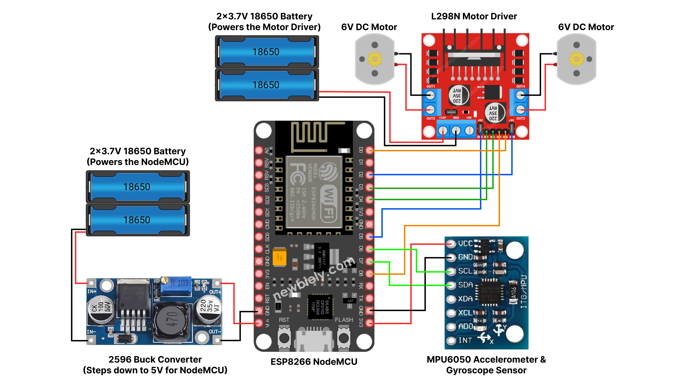
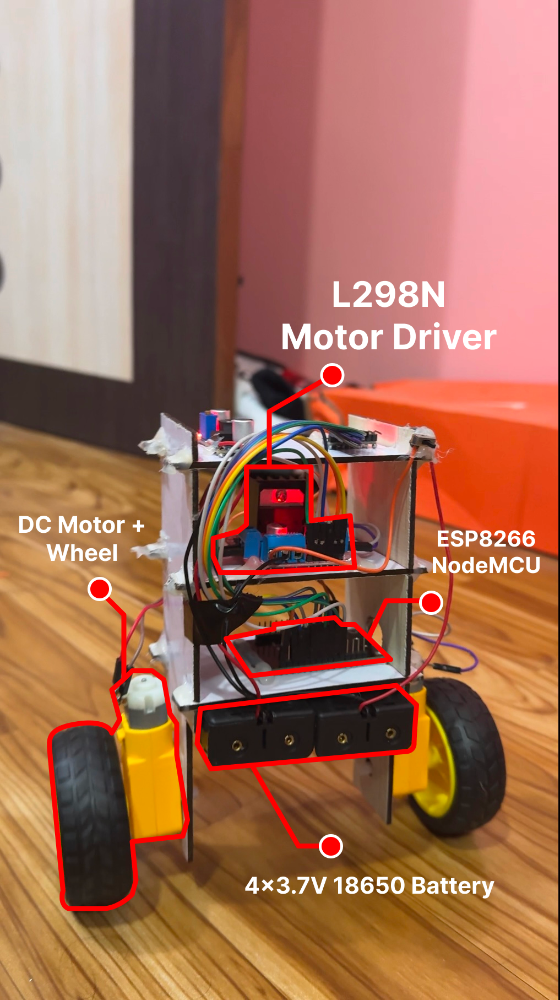

# 🤖 Self-Balancing Robot

A two-wheeled self-balancing robot modeled as an inverted pendulum and stabilized using a PID control algorithm. Built with an ESP8266 NodeMCU, MPU6050 IMU sensor, and L298N motor driver.

---

## Demo

## 

---

## 🧠 System Overview

This robot continuously reads its tilt using an MPU6050 sensor and adjusts the speed and direction of its motors to maintain upright balance. It uses a closed-loop PID control system:

- **Kp (Proportional):** 40.0
- **Ki (Integral):** 180.0
- **Kd (Derivative):** 2.0

---

## 🧾 Components

| Component              | Quantity | Notes                                     |
| ---------------------- | -------- | ----------------------------------------- |
| ESP8266 NodeMCU        | 1        | The main microcontroller                  |
| MPU6050 IMU            | 1        | Accelerometer + Gyroscope for orientation |
| L298N Motor Driver     | 1        | Controls the two DC motors                |
| 6V DC Geared Motors    | 2        | With wheels                               |
| 2596 Buck Converter    | 1        | Steps down voltage for NodeMCU            |
| 18650 Li-ion Batteries | 4        | 2 for motors, 2 (via buck) for NodeMCU    |
| Robot Chassis          | 1        | Two-layered chassis                       |
| Jumper Wires           | –        | For all electrical connections            |

## 🖼️ Diagrams

### 📷 Circuit Diagram



### Key Connections (ESP8266 NodeMCU):

#### MPU6050:

- SDA → D7 (GPIO 13)
- SCL → D6 (GPIO 12)

#### L298N Motor Driver:

- ENA → D6 (GPIO 14)
- IN1 → D4 (GPIO 2)
- IN2 → D3 (GPIO 0)
- IN3 → D8 (GPIO 15)
- IN4 → D0 (GPIO 16)
- ENB → D2 (GPIO 4)

---

#### 1️⃣ Hardware Layout – Top View


#### 2️⃣ Hardware Layout – Side View



---

## 💻 Software & Libraries

This project is developed using the **Arduino IDE**.

### Libraries Used:

- `Adafruit_MPU6050`
- `Adafruit Unified Sensor`
- `Wire` (standard)

Install them using:  
**Sketch → Include Library → Manage Libraries...**

---

## ⚙️ Setup and Operation

1. Assemble the robot hardware according to the wiring diagram.
2. Open the `balance_controller.ino` sketch in the Arduino IDE.
3. Select board: **ESP8266 Dev Module**.
4. Upload the sketch to your NodeMCU.
5. Calibrate the robot to maintain vertical postion by tuning the PID values.
6. Disconnect USB and power the board via batteries.
7. Carefully place the robot upright and gently let go.

---

## 🎯 Setpoint Calibration

In the code, you'll find:

```cpp
float setpoint = 0.35;
```

This is the **target pitch angle** the robot aims to maintain. You may slightly adjust this value depending on your robot’s physical center of mass. You can find this value by running `setpoint_calc.ino`.

---

## 🎛️ PID Tuning

No need to re-upload code — **PID gains can be updated via the Serial Monitor**.

### 📟 How to Tune

1. Connect the robot to your PC via **USB**.
2. Open **Serial Monitor** at `115200 baud`.
3. Type commands like:
   - `p45.5` → Sets **Kp** = 45.5
   - `i200` → Sets **Ki** = 200
   - `d1.8` → Sets **Kd** = 1.8
4. Observe the robot's behavior and tune for:
   - Minimal oscillation
   - Stable balance

---

## 👨‍💻 Contributors

- [Ashish Adhikari](https://github.com/Aashish1-1-1)
- [Swastik Aryal](https://github.com/Swastik-Aryal)
- [James Bhattarai](https://github.com/jamesii-b)
- [Rikesh Panta](https://github.com/RiCEmare)

---
